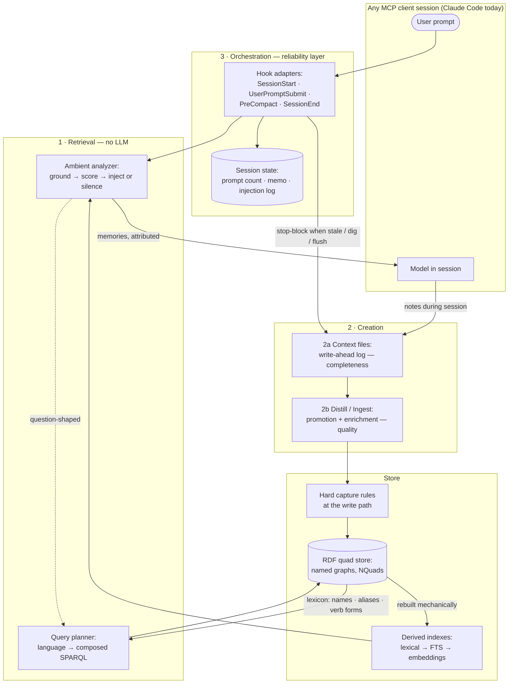
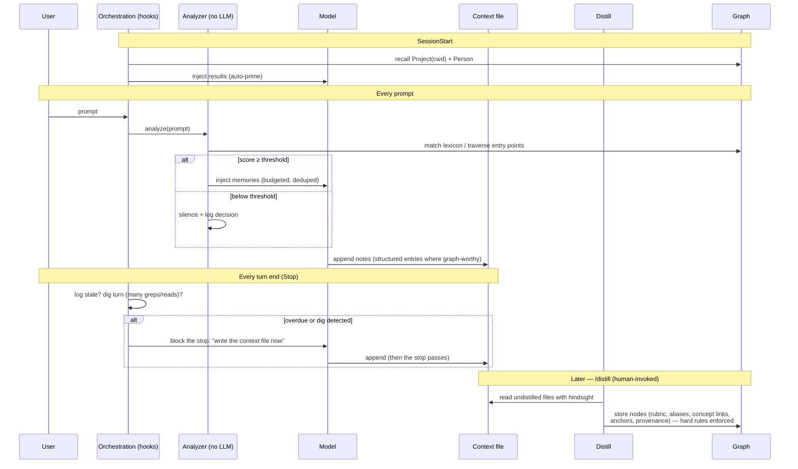
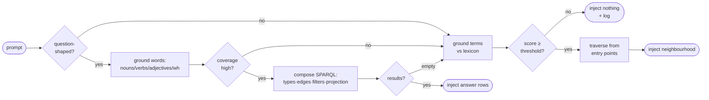
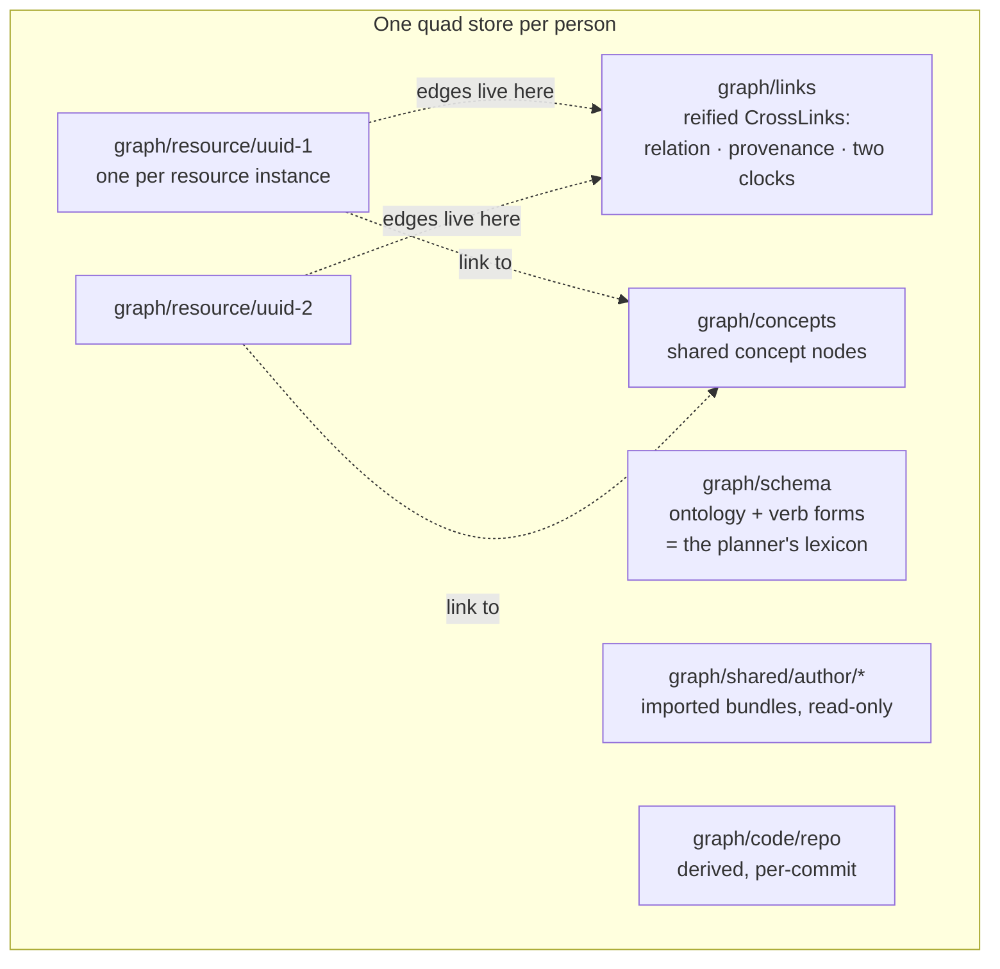

# System design — how the pieces fit together

The one-page map. Terms: [GLOSSARY.md](GLOSSARY.md). Per-subsystem depth: linked throughout.
Diagrams are Mermaid — GitHub renders them inline.

## The subsystems

Two horizons sit beyond the loop, both reusing its parts:
**sharing/federation** (share bundles → hosted stores → policy-gated `expand` between DBs) and
the **derived code graph** (structure generated per commit, joined to memory via code anchors).

## The memory loop, end to end

## The retrieval decision

The floor of every path is today's behaviour or silence — never a guess.

## Data layout

## Technology choices

| Layer | Choice | Why | Deliberately not |
|---|---|---|---|
| Store | pyoxigraph (in-memory + NQuads dump; RocksDB when hosted) | RDF-native, SPARQL built in, zero infra | Neo4j/property graphs (lose SPARQL/standards interop) |
| Data model | RDF named graphs, reified links | containment, provenance, temporal props on edges, CIDOC/Arches/SKOS/Solid interop | RDF-star (reification already paid for) |
| Interface | MCP (stdio now, remote HTTP when hosted) | model-agnostic — the cross-model persistence story | client-specific plugins as the core |
| Client adapters | Claude Code hooks + skills | mechanical triggers where the client allows | relying on protocol prose (instruction decay) |
| Analyzer/planner | Python stdlib + regex; lexicons read from the graph | deterministic, ms-fast, zero deps | an LLM in the read path — ever |
| Escalations (earned by metrics only) | POS tagger (NLTK/spaCy-small) → local embedding encoder (MiniLM-class, ONNX) | close observed gaps, still no LLM, still local | cloud embedding/judge APIs (latency, cost, privacy) |
| Enforcement | server-side Python at the write path (`capture_rules.py`) | rules that can't decay | SHACL engines (overkill at this scale) |
| Testing | pytest + `uv`, fixture graphs in tmp dirs | pure functions test like compilers | LLM-judged evals as the primary harness |

## The patterns (recurring, load-bearing)

1. **Spend intelligence at write time** — aliases, concept links, verb forms, anchors are
   written once by the LLM already in session; read time stays dumb, fast, private.
2. **Authored vs derived** — knowledge (graph, travels, shareable) vs matching structure
   (indexes, code graph — rebuildable, disposable). Never confuse the two.
3. **Nominate / dispose** — the analyzer nominates candidates; the in-session model disposes.
   No second LLM just to decide whether to look.
4. **Fail toward silence, fail open** — wrong injections poison trust; a broken memory layer
   must never degrade a session.
5. **Nothing is deleted; facts get bounded** — soft delete, supersedes chains, contradiction
   closure with two clocks.
6. **Reachability ≠ exposure** — sharing is manifest/policy-driven, never traversal-driven.
7. **The ontology is the lexicon** — self-describing schema doubles as the NL grounding
   vocabulary; extending one extends the other.

## Requirements

**Functional**
- F1 Memories persist across sessions and (via MCP) across models/clients.
- F2 Relevant memories reach the context window without the model asking (ambient injection).
- F3 Question-shaped prompts get structural answers (composed SPARQL), not just neighbourhoods.
- F4 All writes pass the hard capture rules; provenance is stamped server-side.
- F5 Contradicted links are closed (two clocks), never silently replaced; retrieval defaults
  to currently-valid facts.
- F6 Context logging and distill triggering fire mechanically (counted prompts, mtime,
  Stop blocks, dig detection, flush hooks), not by model discipline.
- F7 Sharing is opt-in per node via manifest; imported knowledge is read-only and attributed.

**Non-functional**
- N1 **Read path: no LLM, no network.** Deterministic; same prompt + same graph → same
  injection.
- N2 **Per-prompt overhead ≤ ~100 ms**; injections within a token budget (~a few hundred).
- N3 **Precision over recall**: false-injection rate is the tuned metric; silence is default.
- N4 **Fail open**: analyzer/store errors → the session proceeds unaffected.
- N5 **Privacy**: prompt analysis and matching happen locally; nothing leaves the machine to
  decide relevance.
- N6 **Auditability**: every injection decision logged; every node carries provenance; store
  is a human-readable, diffable file.
- N7 **Personal scale**: thousands of nodes with linear scans; the index/FTS/ANN ladder is the
  documented path beyond.

## How we test

| Subsystem | Method | Status |
|---|---|---|
| Hard capture rules | pytest unit tests over fixture stores (name lint, required props, duplicate guard, concept identity, provenance) | **20 passing** |
| Contradiction closure / two clocks | unit tests: close-on-conflict, worldChange vs correction filtering, "true now" default | when implemented |
| Analyzer | **golden tests** (fixture graph + prompt table → expected inject/silence + nodes); **refusal suite** (prompts that must stay silent); determinism check (same input → same output) | design ready |
| Query planner | golden **question → expected result rows** over a seeded graph (assert results, not SPARQL text); grounding unit tests; refusal tests for half-groundable questions | design ready |
| Grounding coverage | run the grounder over real transcripts; % of question prompts fully grounded — the go/no-go metric for grammar size and the POS-tagger decision | first experiment |
| Orchestration | hook integration tests: counted prompts, Stop block on stale mtime (repeat-until-write, never-chain), dig counting per turn, flush on PreCompact, fail-open on corrupt state | **passing** (tests/test_gate.py, hook-kit/tests) |
| Live tuning | injection log + miss detector (explicit recall after silence = logged false negative) reviewed against real sessions | continuous |
| External benchmark | LongMemEval, once retrieval is implemented — the objective test of "ontology + discipline beats embeddings + judge" | later |

The testing story is unusually strong for an AI-adjacent system precisely because of N1: the
analyzer and planner are pure functions of (prompt, graph), so they test like compilers —
exact, fast, CI-friendly — with LLM-dependent behaviour confined to creation, where the hard
rules catch its mistakes.

## Reading order

[GLOSSARY.md](GLOSSARY.md) → this file → [ROADMAP.md](ROADMAP.md) (sequencing) → subsystem
depth: [RETRIEVAL.md](RETRIEVAL.md) + [QUERY-PLANNING.md](QUERY-PLANNING.md) ·
[CONTEXT-CREATION.md](CONTEXT-CREATION.md) · [DISTILL-CREATION.md](DISTILL-CREATION.md) ·
[ORCHESTRATION.md](ORCHESTRATION.md) + [TUNING.md](TUNING.md) (observability) → horizons: [SHARING.md](SHARING.md) →
[FEDERATION.md](FEDERATION.md) · [CODE-GRAPH.md](CODE-GRAPH.md) → implementation detail of
what exists today: [ARCHITECTURE.md](ARCHITECTURE.md).
